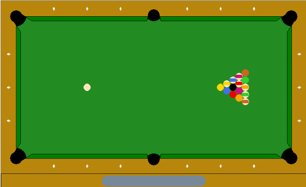
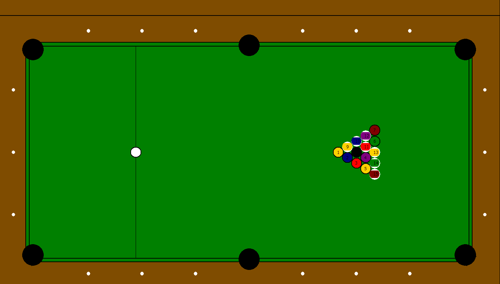
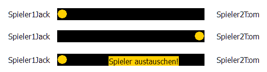

\begin{titlepage}
\setlength{\voffset}{1.5cm}

\unitlength1mm
\begin{picture}(210,25)(31.38,-25)
\put(0,0){\includegraphics*[viewport=0 723 595 796]{figures/IDS-Logo.pdf}}
\end{picture}

\center
\vspace{-4em}
\Large{\textsf{\TYPE}}
\vspace{3em}

\Huge{\textbf{\textsf{\TITLE}}}

\vspace*{\fill} 
\large{
	\textsf{
		angefertigt von\\
		\vspace{1em}
		\textbf{
			\AUTHOR \\
		}
		%Matr.-Nr.: \MATRIKELNR\\
	}
}
\vspace{4em}
\large{
	\textsf{
		am\\
		\vspace{0.5em}
		\textbf{
			Institut für Dynamik und Schwingungen\\
			Technische Universität Braunschweig\\
		}
	}
}
\vspace{2em}
\large{
	\textsf{
		Betreuer:\\
		\vspace{0.5em}
		\textbf{
			Prof. Dr.-Ing. habil. G.-P. Ostermeyer\\
			\BETREUER\\
		}
	}
}
\vspace{7em}
\Large{
	\textbf{
		\setdatetoday
		\datemonthname \ \the\year
	}
}
\end{titlepage}

\addchap*{Eidesstattliche Erklärung}

\vspace*{5cm}

Hiermit erkläre ich eidesstattlich, dass ich diese Arbeit eigenständig angefertigt und keine anderen als die angegebenen Hilfsmittel verwendet habe.

\bigskip
Braunschweig den \today

\tableofcontents

# Einführung

## Aufgabenstellung

>Aufgabe: 
>Erstellen Sie ein initiales Spielfeld wie angegeben. Durch Mouseevents soll zu Spielbeginn die Stoßrichtung und Geschwindigkeit der weißen Kugel vorgegeben werden. Dazu ist mit der Mouse ein Queue anzutragen. Im weiteren Spielverlauf sollen alle Kugeln wie beim klassischen Poolbillard per Queue bewegt werden.  Nutzen Sie die in der Vorlesung gegebenen Grundlagen zur Darstellung und Simulation von Stoßereignissen.  Beachten Sie die unterschiedlichen Bewegungsgleichungen für Kugel/Kugel bzw. Kugel/Banden-Kontakt. Zusätzlich soll 

## Das Spiel

Billiard ist ein Geschicklichkeitsspiel bei dem Kugeln mit Hilfe eines Stabes, der Queue genannt wird, in Löcher gestoßen werden. Dabei werden die 15 farbigen Kugeln nicht direkt mit dem Stab angespielt. Vielmehr spielt man mit dem Queue den weißen Spielball, der dann die anderen  Kugeln so anstoßen muss, dass diese in die Löcher fallen. Bei der von uns betrachteten Variante dem Poolbillard muss die schwarze 8 zuletzt eingelocht werden.

## Stoß

Der wichtigste physikalische Vorgang bei der Simulation eines Billardspiels ist der Stoß. Dieser ist das Zusammentreffen zwischen zwei Körpern, bei dem die Kinetische Energie konstant bleibt. Bei der Kollision wird die kinetische Energie zunächst in potentielle Energie umgewandelt. Dies geschieht durch eine Verformung der Körper, welche die gespeicherte Energie dann wieder als kinetische Energie abgeben.

Grundsätzlich lassen sich Stoßvorgänge in elastisch und inelastisch einteilen. Beim elastischen Stoß wird die gesamte kinetische Energie bei der Verformung der Körper in potentielle Energie umgewandelt. Beim inelastischen Stoß wird hingegen ein Teil der Energie in andere Energieformen konvertiert -- vor allem Wärme, Schall und die plastische Verformung von einem der Körper.

Im makroskopischen Bereich ist der elastische Stoß nur als Idealisierung zu betrachten, da immer Wärme erzeugt wird. Wirklich elastische Kollisionen sind nur auf der Ebene von Atomen oder Quantenobjekten möglich. Zur Vereinfachung kann man den Verlust von kinetischer Energie vernachlässigen, unter der Voraussetzung, dass er gegenüber der Bewegungsenergie sehr klein ist. Bei der Kollision von zwei Billardkugeln -- welche oft als Beispiel für den elastischen Stoß verwendet wird ist dies der Fall [@Cross_2014].

Im gegensatz zu den Kugeln, welche aus Phenoplast hergestellt werden, besteht der Bandenspiegel um den Tisch herum aus vulkanisierten Elastomeren, welche dazu dienen den Energieverlust des Balles gering zu halten. Je nach den gewählten Materialien unterscheidet sich das Effet verhalten des Balles. In unserem Fall gehen wir von einer harten und dichten Bande aus. Der Stoß kann so als rein elastisch betrachtet werden.

## Reibung
### Rollreibung

Das zweite physikalische Phänomen, welches beim Billardtisch auftaucht ist die Rollreibung der Kugel auf dem Tisch, beziehungsweise Tuch. Die Rollreibung lässt sich durch die nachfolgende Gleichung bestimmen.
\begin{align*}
F_R &= c_R \cdot F_N \\
F_R &: \text{Rollwiderstand} \\
F_N &: \text{Normalkraft} \\
c_R &: \text{Rollwiderstandskoeffizient}
\end{align*}
Die Rollreibung entsteht durch die Verformung des Untergrundes durch das rollende Objekt, sowie an durch die Verformung des Objektes selbst. Je weicher der Untergrund oder Objekt desto größer die Verformung und dementsprechend die Reibung.
\begin{figure}
\centering
\begin{tikzpicture}
[
	  > = latex,
    very thick
]

  \draw (0,0.95) circle (1);
  \draw (-2,0) to (-0.35,0);
  \draw (2,0) to (0.35,0);
  \draw[dotted] (-0.35,0) to (0.35,0);
  \draw[thin] (0, -0.3) to (0, 2.3);
  \draw[thin] (0.35, -0.3) to (0.35, 2.3);
  \draw[thick] (-0.35,2.2) to node[above] {$d$} (0.7,2.2);
  \draw[thick,->] (-0.35,2.2) to (0, 2.2);
  \draw[thick,<-] (0.35,2.2) to (0.7, 2.2);
  \draw (0.35,0) to[bend right=20] (0.7,0.2) to[bend left=70] (1.2,0);

  \draw[->] (-1.9, 1.5) to node[above] {$\vec{v}$} (-1.2,1.5);
  \draw[->] (0, 0.95) to node[above] {$R$} (-0.86,1.4);
  \draw[->] (1.5, 0.2) to node[above] {$F_R$} (0.8,0.2);
  \draw[->] (0,0) to node[left] {$F_N$} (0,0.6);
  \draw[->,thick] (0,0.7) arc[start angle=270, end angle=30, radius=0.3];

\end{tikzpicture}
\caption{Schematische Darstellung der Kräfte und Verformungen beim Rollvorgang.}
\end{figure}

Die Verformung des Untergrundes besteht aus einem Einsinken des Körpers und einer Anhäufung von Material vor dem Körper selbst. Dies ist Schematisch in der obigen Skizze dargestellt. Ein Weicherer untergrund führt zu mehr Einsinken und damit auch zu mehr Material in der Bahn des Rollkörpers. Wenn die tiefe des Einsinkens bekannt ist lässt sich hieraus auch der Rollwiderstandskoeffizient zu $c_R  = \frac{d}{R}$ bestimmen. Hierbei ist $d$ die  Strecke zwischen der Rotationsachse des Rollkörpers und der Stelle, an der sich dessen Außenradius mit der weitergedachten Höhe des Untergrundes schneidet. Da beim Billard entscheidend ist, dass die Rollreibung möglichst gering ist, werden Billardtische in der Regel aus Schiefer gefertigt, da dieser Stein besonders spröde ist. Auch Tische mit Holz oder Stahlplatten werden gefertigt. Der Tisch wird dann mit einem Schweren Tuch bespannt

### Luftwiederstand
Die zweite Art von Reibung welche eine Rolle für unser Problem spielt, ist der wiederstand der Luft. Dieser lässt sich einfach über den folgenden Zusammenhang errechnen.
\begin{align*}
F_{L}&=\frac{1}{2} \rho v^{2} C_{D} A\\
\\
F_{L}&=\text{Luftwiederstand} \\
\rho &= \text{Dichte}\\
v &= \text{relative Geschwindigkeit}\\
C_{L} &= \text{Reibungskoeffizient}\\
A &= \text{Querschnittsfläche} \\
\end{align*}

# Grundlagen

In diesem Kapitel werden die Schritte erklärt die Notwendig sind, um die physikalischen Grundlagen in eine numerische Simulation umzusetzen.

## Physikalisch

### Geradlinige Bewegung
Bevor es überhaupt zu den in der Einleitung angesprochenen Stössen kommen kann, muss zunächst die geradlinige Bewegung der Kugeln realisiert werden.
Da die Ausgabe als 2D Grafik erfolgt, ist es naheliegend auch ein 2-Dimensionales Koordinatensystem für die Positionen und die Bewegungen der Kugeln zu wählen. In diesem hat jede Kugeln eine Position, eine Geschwindigkeit und eine Beschleunigung als Eigenschaften.

\begin{figure}
\centering
\begin{tikzpicture}
[ very thick,
  > = latex
]

  \coordinate (a) at (1,1);
  \coordinate (v1) at (2.6,3);
  \coordinate (b) at (4,1.8);
  \draw[thick,<->] (0,3) node[above left] {$y$} |- (6,0) node[below] {$x$};

  \draw (a) circle (0.9);
  \draw (b) circle (0.9);
  \draw (a) node[below] {$x_1,y_1$} ;
  \draw (b) node[above] {$x_2,y_2$} ;
  \draw  (a) node[] {\Large +};
  \draw  (b) node[] {\Large +};

   \draw[thick, ->] (b) to node[right, midway] {$r$} (4.35,1);

  \draw[dashed, ->,thick] (a) to (2.6,3) node[below=1mm] {$v_1$};
  \draw[dashed, ->,thick] (b) to (2.3,0.3) node[right=1mm] {$v_2$};
  \draw[thick,dotted,->] (a) to node[left,near end] {$v_{1x}$} (1,3);
  \draw[thick,dotted,->] (1,3) to node[above] {$v_{1y}$} (v1);
\end{tikzpicture}
\caption{Koordinaten und Geschwindigkeiten von Kugeln}
\end{figure}

In unserem Fall werden die Geschwindigkeiten und Positionen der Kugeln als Vektoren dargestellt. Weil sich die Geschwindigkeit $\vec{v}$ durch die Kollision mit andere Kugeln ändern kann, ist eine Berechnung der aktuellen Position $\vec{p}$ durch einen Funktionalen zusammenhang wie $\vec{p}(t) = \frac{1}{2}\vec{a^2} + \vec{v} * t + \vec{p}_0$ nicht ohne weiteres möglich. Daher wird die Position in der vorliegenden Iteration aus der vorherigen Berechnet.
$$ \vec{p}_{t} = \vec{p}_{t-1} + \vec{v}_{t} $$
Die Änderung der Geschwindigkeit wird dann separat ermittelt. Hierbei wird die Verlangsamung durch Rollreibung und Luftwiederstand zunächst nur durch die folgende Formel angenähert:
$$\vec{v}_t = \vec{v}_{t-1} \cdot (1 - \mu) \;$$
Der Parameter $\mu$ soll die verschiedenen Konstanten zunächst annähern.

### Kollision mit der Bande

\begin{figure}
\centering
\begin{tikzpicture}
  [
    thick,
    > = latex
  ]

  \coordinate (b) at (2,1.4);
  \draw[line width=1mm]  (0,-2) to (0,2);

  \draw[very thick] (b) circle (0.5);
  \draw[->] (b) to (0,0) to node[sloped,above] {mit Bande} (2,-1.4);
  \draw[dashed, ->] (b) to (0,0) to node[sloped,above] {ohne Bande} (-2,-1.4);
  \draw[thin] (216:0.9) arc (216:324:0.9);
  \draw (243:0.7) node {$\varphi$};
  \draw (293:0.7) node {$\varphi$};

\end{tikzpicture}
\caption{Kollision mit der Bande}
\end{figure}
Das nächste physikalische Problem ist die Kollision von Kugeln und Bande. Hier handelt es sich wie eingangs erwähnt um einen einen elastischen Stoß. Da die Bande unbeweglich und gerade ist gilt, dass sich nur der Anteil der Kraft im Vorzeichen ändert, welcher Senkrecht zur Wand steht. Demnach wäre die Geschwindigkeit nach der Kollision in Abbildung 2.2
$$ v_0 = \begin{bmatrix} v_{x,0} \\ v_{y,0} \end{bmatrix}, \quad v_1 = \begin{bmatrix} - v_{x,0} \\ v_{y,0} \end{bmatrix} $$

### Kollision von zwei Kugeln

Wie oben bereits angeführt, ist das Zusammentreffen von zwei Kugeln ein elastischer Stoß. Für diesen gilt im eindimensionalen Fall folgende Gleichung:
$$ v_{a1} m_{a1} + v_{b1} m_{b1} = v_{a2} m_{a2} + v_{b2} m_{b2}$$
Dieser Zusammenhang lässt sich allerdings nicht direkt auf den Zweidimensionalen Fall Anwenden. Dieser kann jedoch so vereinfacht werden, dass die obige Formel zumindest indirekt zur Berechnung verwendet werden kann. Um eine effiziente Berechnung im Computer zu gewährleisten, sollte auch möglichst auf den Einsatz von trigonometrischen Funktionen verzichtet werden, da diese nach eigenen Tests mit einem mehr an Rechenaufwand verbunden sind. Eine überprüfung von Verschiedenen Rechenoperationen ergab folgendes Ergebnis:\footnote{Der für den Test verwendete Code findet sich im Anhang. Als Compiler wurde gcc, verwendet, da kein ersatz für die C++-crono library in Borland gefunden werden konnte.}

\begin{figure}[H]
\centering
\begin{tabular}{llllll}
\toprule 
 Operation  & Zeit für 10e8 Wiederholungen  in $s$ \\
 \midrule
 plus       & 0.1681851                     \\
 minus      & 0.1604299                     \\
 mult       & 0.1584505                     \\
 div        & 0.3010148                     \\
 sqrt       & 0.2361831                     \\
 sin        & 1.1046720                     \\
 cos        & 0.9211685                     \\
 tan        & 2.6617312                     \\
 atan       & 2.5101218                     \\
 exp        & 0.5926420                     \\
\bottomrule
\end{tabular}
\end{figure}

Demnach braucht eine $\sin()$ Operation fast 7x mehr Zeit, als eine Multiplikation. Da die Geschwindigkeiten und Positionen der Kugeln bereits Vektoren sind, ist es Sinnvoll auch die Berechnung der Geschwindigkeiten nach dem Stoß durchzuführen.
Hierzu wird zunächst ein Vektor bestimmt und normiert, welcher vom Mittelpunkt von Kugel 1 zu Kugeln 2 zeigt. 
\begin{align*}
\vec{n} &= \begin{bmatrix} k2_x \\ k2_y \end{bmatrix} - \begin{bmatrix} k1_x \\ k1_y \end{bmatrix} \\
\hat{n} &= \frac{\vec{n}}{||\vec{n}||}\\
\end{align*}
Die Geschwindigkeiten der Kugeln werden dann auf den Normalenvektor projiziert. Hieraus wird dann die Differenz der Geschwindigkeiten normal zum Differenzvektor der Kugeln ermittelt. Da beim elastischen Stoß keine Kräfte in Tangentialrichtung übertragen werden, müssen dies nicht Betrachtet werden.
\begin{align*}
\Delta \vec{v} = \vec{v}_{1n} - \vec{v}_{2n} = \hat{n} \bullet \vec{k2_v} - \hat{n} \bullet \vec{k1_v}
\end{align*}
\begin{tikzpicture}
[
	  > = latex,
    very thick
]

  \coordinate (k1) at (-2, -1);
  \coordinate (k2) at (1, 2);

  \coordinate (t1) at (1, -1);
  \coordinate (t2) at (-2, 2);

  \coordinate (v1) at (-3, 3);
  \coordinate (v2) at (-2, 3.3);

  \draw (k1) node[below right] {$k1$} circle (2.1);
  \draw (k2) node[below right] {$k2$} circle (2.1);

  \draw[->, thick] (k1) to node[near start, below right] {$\vec{n}$} (k2);
  %\draw[->] (k1) to  ($(k2) - (2,2)$);

  \draw[->, thick] (t1) to node[at start, above right] {$\vec{t}$} (t2);

  \draw[->] (k1) to node[below left, near end] {$\vec{v1}$} (v1);
  \draw[->] (k2) to node[below left, near end] {$\vec{v2}$} (v2);

\end{tikzpicture}
\begin{tikzpicture}
[
	  > = latex,
    very thick
]

  \coordinate (k1) at (-2, -1);
  \coordinate (k2) at (1, 2);

  \coordinate (t1) at (1, -1);
  \coordinate (t2) at (-2, 2);

  \coordinate (v1) at (-3, 3);
  \coordinate (v2) at (-2, 3.3);

  \coordinate (p1) at (-0.5, 0.5);
  \coordinate (p2) at (0.15, 1.15);

  \draw[->, thick] (k1) to node[near start, below right] {$\vec{v}_{1n}$} (p1);
  \draw[->, thick] (k2) to node[near start, below right] {$\vec{v}_{2n}$} (p2);

  \draw[->] (k1) to node[below left, near end] {$\vec{v1}$} (v1);
  \draw[->] (k2) to node[above right, near end] {$\vec{v2}$} (v2);

  \draw[dotted, thick] (v1) to (p1);
  \draw[dotted, thick] (v2) to (p2);

\end{tikzpicture}

Die so erhaltene Differenz der Geschwindigkeiten kann verwendet werden um die Finale Geschwindigkeit der beiden Kugeln zu errechnen. Da das Problem wieder auf den eindimensionalen Fall zurück geführt werde konnte kann auch die entsprechende Formel herangezogen werden. Die Geschwindigkeiten ergeben sich dann zu:
\begin{align*}
k1_{v2} &= \frac{k1_m}{k2_m} (k1_{v1} + \Delta \vec{v} \circ \hat{n}) \\
k2_{v2} &= \frac{k2_m}{k1_m} (k2_{v1} - \Delta \vec{v} \circ \hat{n})
\end{align*}

## Informatik
Nachdem die Gleichungen ermittelt wurden die zu Umsetzung von Stößen und Reibung notwendig sind, sollen nun einige Probleme bei der Umsetzung also Computerprogramm besprochen werden.

### Representation der Kugeln

Hier wird eine eigene Klasse für die Kugel verwendet, welche Folgende Attribute und Methoden enthält.

\begin{figure}
\centering
\begin{tikzpicture}
\tikzumlset{fill class=white}
\umlclass{Kugel}{
\begin{tabular}{lll}
  number      &:& int \\
  radius      &:& double \\
  mass      &:& double \\
  position    &:& TVektor \\
  next   &:& TVektor \\
  velocity      &:& TVektor \\
  inGame &:& bool \\
  color  &:& TColor
\end{tabular}
  }{
\begin{tabular}{lll}
  init()      &:& void \\
  move()      &:& void \\
  draw()      &:& void
\end{tabular}
  }
\end{tikzpicture}
\caption{Kugelklasse UML-Diagram}
\end{figure}

#### Verwendung im Programm

Im Programm selbst wird dann ein Array aus Kugeln gebildet. Da über diesen zum Beispiel mit einem for-loop iteriert werden kann, lassen sich viele Berechnungen sehr kompakt darstellen.

### Kollisionserkennung

Um nun zu erkennen, ob eine Kugel mit einer anderen Kollidiert kann der Hypothenusensatz angewendet werden. Hierzu kann man die Positionen \texttt{pos} von zwei Kugeln subtrahieren und erhält so einen Vektor für den Abstand. Eine Kollision zwischen zwei Kugeln liegt also vor, wenn gilt: $$r \geq \sqrt{(\texttt{k1}_{\text{pos,x}} - \texttt{k2}_{\text{pos,x}})^2  + (\texttt{k1}_{\text{pos,y}} - \texttt{k2}_{\text{pos,y}})^2} $$ Hierbei bezeichnen \texttt{k1} und \texttt{k2} jeweils eine Instanz der Kugel-Klasse. Sobald diese Bedingung erfüllt ist kann dann eine Funktion zur Berechnung des Stoßes ausgeführt werden.

Die Erkennung von Kollisionen mit der Bande gestaltet sich rechnerisch noch simpler. $$ r \geq |\texttt{k}_{\text{pos,x}} - \text{Bande}_\text{x} | $$

### Continuous Collision Detection (CCD)
Bei der Kollision mit der Bande kann es allerdings zu einem optisch störenden Phänomen kommen, bei dem die Kugel für einen Frame außerhalb der Spielfeldes gezeichnet wird. Da die Berechnung für die einzelnen Frames diskret verläuft, wird erst wieder im nächsten Durchlauf überprüft, ob die Bedingung für die Kollision erfüllt ist. Besonders bei hohen Geschwindigkeiten der Kugel, kann es also dazu kommen, dass diese merklich außerhalb der Spielgrenzen dargestellt wird.
\begin{figure}
\centering
\begin{tikzpicture}
  [
    thick,
    > = latex
  ]

  \coordinate (a) at (1.7,1.4);
  \coordinate (b) at (1,0);
  \coordinate (c) at (0.3,-1.4);
  \coordinate (ab) at (0,1.4);
  \coordinate (bb) at (0,0);
  \coordinate (cb) at (0,-1.4);
  \coordinate (al) at (3.5,1.4);
  \coordinate (bl) at (3.5,0);
  \coordinate (cl) at (3.5,-1.4);
  \draw[line width=0.5mm]  (0,-2) to (0,2);

  \draw[very thick] (a) circle (0.5);
  \draw[very thick] (b) circle (0.5);
  \draw[very thick] (c) circle (0.5);

  \draw (a) to node[midway, above]   {$d_1$} (ab);
  \draw (b) to node[near end, above] {$d_2$} (bb);
  \draw (c) to node[near start, above]   {$d_3$} (cb);

  \draw (ab) node[left=1cm] {$t = 1$};
  \draw (bb) node[left=1cm] {$t = 2$};
  \draw (cb) node[left=1cm] {$t = 3$};

  \draw (al) node[] {$d_1 > r$};
  \draw (bl) node[] {$d_2 > r$};
  \draw (cl) node[] {$d_3 < r$};
\end{tikzpicture}
\caption{Erst für $t_3$ wird die Kollision erkannt.}
\end{figure}

Grundsätzlich gibt es drei Möglichkeiten dieses Problem zu lösen. Zum einen kann eine Höchstgeschwindigkeit eingeführt werden, um die Bewegung in Pixeln pro Iteration zu verringern. Eine weiter Option ist es die Anzahl an Iterationen zu erhöhen um den selben Effekt zu erreichen. Die Lösung die jedoch nicht nur stochastische Sicherheit bietet und unabhängig von der Geschwindigkeit und Framerate ist, ist die kontinuierliche Kollisionskontrolle CCD. 

Um sicherzugehen, dass keine Kugeln außerhalb des Spielfeldes angezeigt werden können wurde an den Rändern eine CCD implementiert. Dabei wird berechnet, ob im kommenden Zeitschritt eine Kollision mit der Bande Auftritt, falls dies der Fall ist, wird Position errechnet, welche die Kugel, nach der Richtungsänderung haben wird. Diese Position wird dann in das Attribut \texttt{next} der entsprechenden Kugel gespeichert und im nächsten Zeitschritt als Position der Kugel gesetzt. 

\begin{figure}
\centering
\begin{tikzpicture}
  [
    thick,
    > = latex
  ]

  \coordinate (b) at (2,1.4);
  \draw[line width=1mm]  (0,-2) to (0,2);

  \draw[very thick] (b) circle (0.5);
  \draw[->] (b) to (0,0) to node[sloped,above] {} (1.6,-1.12);
  \draw[dashed, ->] (b) to (0,0) to node[sloped,above] {} (-1.6,-1.12);

  \draw[dotted] (b) to node[above] {$d_1$} (0,1.4) to node[above] {$d_2$} (-1.6,1.4);
  \draw[dotted] (0,-1.12) to node[below] {$d_2$} (1.6,-1.12);
\end{tikzpicture}
\caption{CCD Schaubild}
\end{figure}

Zur Berechnung ist vor allem der Anteil der Zeit wichtig, nach der die Kollision mit der Bande stattfinden würde. Um die kritische Zeit $t_c$ zu erhalten, gilt: $$ t_c = \text{Bande}_x + r - \frac{\texttt{k}_{\text{next,x}}}{\texttt{k}_{\text{pos,x}} - \texttt{k}_{\text{next,x}}}$$
Hier ist $t_c$ der Anteil der Zeit an einem Zeitschritt, nach dem die Kollision auftreten würde, wenn die Kugel die Bahn entlang der gestrichelten Linie in Abbildung 2.5 weiter mit Konstanter geschwindigkeit verfolgt. $d_1 + d_2$ ist hier die Strecke die bei der in diesem Zeitschritt ohne CCD zurück gelegt werden würde. $d_1$ ist die Strecke die bis zu $t_c$ zurückgelegt wird. Wenn man nun den die $t_c$ kennt kann man die Strecken $d_1$ und $d_2$ bestimmen. Hier ergibt sich:
\begin{align*}
d_1 &= t_c \texttt{k}_{\text{v,x}} \\
d_2 &= (1-t_c)  \texttt{k}_{\text{v,x}} \\
\texttt{k}_{\text{next,x}} &= \text{Bande}_{\text{x}} + r + (1 - t_c) \texttt{k}_{\text{v,x}} (1 - \mu)
\end{align*}

Der $(1-\mu)$ Term, geht aus der Einbeziehung der Rollreibung hervor. Da in jedem Zeitschritt die Geschwindigkeit durch die Reibung verringert wird, muss dies auch bei der Berechnung der zukünftigen Positionen  einbezogen werden.

Die so erhalten \texttt{X}-Koordinate wird als Position für die Kugel \texttt{k} im nächsten Zeitschritt gesetzt. Somit übertritt die Kugel niemals die Grenze des Spielfeldes und der oben angesprochene Darstellungsfehler wird behoben.

# Erklärung der Graphischen Oberfläche
 
## Queue

Die Zentralpunkt der Weißkugel wird nur berücksichtigt, damit der Schlagen zwischen Queue und Weißkugel vereinfacht wird. Deshalb werden nur die Richtung und die Kraft des Queue im Programm kontrolliert.                      

\begin{figure}
\centering
\includegraphics[]{images/queue1.png}
\end{figure}

Wie in der Abbildung gezeigt, ist es notwendig, dass der Queue rund um die Weißkugel $360^{\circ}$ drehen kann. Außerdem muss es erfüllt werden, dass der Queue sich verändert, wenn die Richtung der Zielkugel wechselt wird. Das stellt sicher, dass sich der Queue in der Richtung bewegt. Deshalb wird die drehende Winkel des Queue bestimmt, wenn der drehende Winkel der Zielkugel festgelegt wird. Im Folgend wird das Festlegen der Winkel von der Zielkugel beschrieben.

\begin{figure}
\centering
\includegraphics[]{images/queue2.png}
\end{figure}

Der Winkel und die Kraft, mit der der Queue auf die Kugel trifft, werden aus dem Abstand zur Maus bestimmt. Wird ein Dreieck gebildet und die Werte für die Katheten werden aus $\Delta X$ bzw. $\Delta y$ bestimmt. Mithilfe des $\tan()$ kann dann der Winkel bestimmt werden.

\begin{align*}
\tan(\alpha) &= \frac{\text{Gegenkathete}}{\text{Ankathete}} \\
\alpha &= \arccos \frac{\text{Ankathete}}{\text{Hypotenuse}}
\end{align*}

Nach Formel wird der Winkel durch die beiden Differentwerte berechnet. Aber es ist zu beachten, dass es Problem mit $\tan(\alpha)$ bei $\alpha = 90^{\circ}$ gibt. Wenn $\alpha$ als $90^{\circ}$ gleich, wird Ankathete gleich $0$. Nach dem Prinzip, dass der Nenner nicht gleich $0$ sein dar, stürtzt das Programm ab. Deswegen wird der Winkel durch Formel 2 berechnet. Die Richtungen des Queue und der Zielkugel können daher eingestellt und berechnet werden.

Die Kraft des Billardsqueue wird durch die Buttons in zwei Formen zeigt, wie in der Abbildung dargestellt.

\begin{figure}
\centering
\includegraphics[width=5cm]{images/kraft_buttons.png}
\end{figure}

Wenn der Button "Distanzenkraft" gedrückt wird, wird die Größe der Kraft proportional entsprechend der Distanzen zwischen Weißkugel und Zielkugel  geändert. Wenn das Button "Zeitenkraft" gedrückt wird, wird die Größe der Kraft mit der Zeit proportional geändert.

\begin{figure}
\centering
\includegraphics[width=8cm]{images/kraft_anzeige.png}
\end{figure}

Die ausgeübte Kraft wird im Rot/Grauen Balken unter dem Spielfeldrand dargestellt. Wenn der Balken gänzlich Grau erscheint wirkt keine Kraft. Mit steigender Kraft wird er zunehmend Rot eingefärbt und bei maximaler Kraft ist er vollständig rot.

## Spieler_Name

\begin{figure}
\centering
\includegraphics[width=5cm]{images/spieler_namen_button.png}
\end{figure}

Wann der entsprechende Button in der Abbildung gedrückt wird, wird die Inputbox angezeigt, um den Name der Spieler, den  man umbenennen möchte, einzugeben. Ansonsten wird der Standardname angezeigt.

## Tischplatte 

Auf der Tischplatte liegen 6 schwarzen Löcher und 16 Kugeln. Die Kugeln sind mit Nummern und Farben gekennzeichnet. Die statistische Daten bzw. die Maße und Positionen der Kugeln sind In einem bestimmten Verhältnis standardisiert.

## Spielereihe \

 
In jeder Runde sollte nur ein Spieler schlagen. Die Stelle des gelben Kugel zeigt den Spieler, der in dieser Runde schlagen sollte. Wenn die Reihe des Spielers gewechselt wird, entsteht der Hinweis „Spieler austaschen ”.

## Zugehörigkeit 

Nachdem ein Spieler erst den Kugeln ins Loch gestoßen, wird die Zugehörigkeit bestimmt. In einem Spiel sollte die bestimmte Zugehörigkeit nicht mehr verändert werden. Der Text auf gelbem Hintergrund zeigt, welche Kugeln(vollfarbe Kugeln oder halbfarbe Kugeln) die unten gezeigten Spieler schlagen sollten.

## Kugeln in Löcher

Das unter der Spielerreihe stehenden Feld zeigt, welche Kugeln in diesem Augenblick in den Löcher sind, d.h. nicht in dem auf dem Tisch sind.

## Gameover

\begin{figure}
\centering
\includegraphics[width=6cm]{images/reset.png}
\end{figure}

Wenn ein Spieler den schwarzen Kugel zur falschen Zeit ins Loch geschlagen hat, wird der andere Spieler der Gewinner. In diesem Moment beendet das Spiel und taucht diesen Hinweis auf.

## Winner

\begin{figure}
\centering
\includegraphics[width=7cm]{images/gameover.png}
\end{figure}

Wenn ein Spieler das Spiel gewinnt, taucht dieser Hinweis auf.

# Simulation

Nach dem in den vorangegangenen Kapiteln die zugrundeliegenden physikalischen Gesetze und ihre Umsetzung in ein Computerprogramm behandelt wurden, wird im letzten Abschnitt untersucht wie die Darstellung der Reibung verbessert werden kann und welchen Einfluss eine Variation der Massen von Verschiedenen Kugeln haben kann.

## Reibung
wie in Kapitel 2.1.1 bereits erwähnt, wurde hier die Verlangsamung der Kugel durch die Rollreibung und den Luftwiederstand nur angenähert. Es handelt sich bei der verwendete Formel nicht um einen physikalisch Korrekte representation der tatsächlichen Vorgänge. Dennoch liefert diese simple Rechnung zumindest für hohe Geschwindigkeiten eine überzeugende Verlangsamung. Es kommt allerdings bei kleinen Geschwindigkeiten zu einem Unerwartet langen Rollen der Kugeln. Dies widerspricht jedoch sowohl der Erwartungshaltung der Spieler, als auch der beobachtbaren Realität. 

Um eine bessere Darstellung der Reibung zu erreichen, wurden die beiden Reibungseffekte zunächst getrennt Betrachtet. Grundsätzlich gilt, dass der Einfluss des Luftwiederstandes quadratisch von der Geschwindigkeit Abhängig ist. Damit ist zu erwarten, dass für hohe Geschwindigkeiten der Anteil des Luftwiederstandes an der Verlangsamung größer ist, währen für kleine Geschwindigkeiten eher die Rollreibung ausschlaggebend für das Rollverhalten ist.

### Verhalten bei Rollreibung
Wenn die Reibung als reine Rollreibung -- also geschwindigkeitsunabhängig -- angenommen wird kommt folgende Vorschrift für die Berechnung zum einsatz. $$\vec{v_t} = \vec{v}_{t-1} - (1-\mu)\frac{\vec{v}_{t-1}}{||\vec{v}_{t-1}||}$$
Wenn diese Formel verwendet wird lässt sich beobachten, dass die Kugeln, wenn sie große Geschwindigkeiten erreichen, scheinbar gar nicht abgebremst werden. Wenn man die Weisse Kugel mit maximaler Kraft anstösst, dauert es 20-25 Sekunden, bis die Kugeln wieder zum stillstand kommen. Diese Zeitspanne übersteigt sowohl, die Dauer die zum Spielen angenehm ist, als auch die Tatsächliche Zeit, welche bei einem realen Billardstoß vergeht, Diese Beträgt etwa 6-9 Sekunden
^[Aufgrund von mangelnder Literatur wurde dieser Wert anhand des Spiels ["Shane Van Boening vs Alex Pagulayan | 2018 US Open 8-Ball Championship Final"](https://www.youtube.com/watch?v=-FHz4kf_cus?t=278) gemessen.]

### Verhalten bei Luftwiederstand
Die von der Geschwindigkeit abhängige Reibung mit der Luft, wird hier wieder durch die in Kapitel 2.1.1 verwendete Formel angenähert.
$$\vec{v}_t = \vec{v}_{t-1} \cdot (1 - \mu)$$
Da wir davon ausgehen, dass für kleine Geschwindigkeiten die lineare Rollreibung ausschlaggebend sein wird, versuchen wir den quadratischen Zusammenhang durch eine rekursiv definierte exponentiale Folge abzubilden. Diese lässt sich deutlich einfacher Berechnen. Es wäre also für die Berechnung einfacher, wenn sich diese Konstruktion als hinreichende Näherung herausstellt.

Qualitativ zeigt sich, dass die Kugeln zunächst so verlangsamt werden, wie man es auch von realen Billardkugeln erwarten würde, allerdings rollen die Kugeln am Ende der Bewegung unnatürlich lange aus. Da die Geschwindigkeit durch den obigen zusammenhang nicht null werden kann, wurde hier mit einer Geschwindigkeitsschwelle gearbeitet, ab der davon ausgegangen wird, dass sich die entsprechende Kugel nicht mehr bewegt. Es gilt also $|\vec{v}| < s \rightarrow \vec{v} = 0$. Die Messung der Zeit ergibt für dies Darstellung der Reibung ca. 14 Sekunden. Dies entspricht eher den erwarteten 6-9 Sekunden, als die rein lineare Reibung, ist aber nicht zufriedenstellend.

### Kombination der Effekte
Es liegt nahe die beiden Reibungen zu kombinieren. Dies entspricht eher der realen Situation. Auch die Kombination aus dem schnellen abbremsen am Anfang bei der geschwindigkeitsabhängig Reibung mit der größeren Verlangsamung am Ende bei der linearen Darstellung verspricht ein insgesamt schnelleres abbremsen. In unserem Fall wechselt sich also die Dominanz der Reibungen ab. Dies lässt sich auch experimentell zeigen [@Carty_1957]. Die am einfachsten zu implementierende Lösung ist in diesem Fall beide Reibungseffekte zu berechnen und die Betragsmäßig größere Verlangsamung zu verwenden. 
$$v_t = \min \left\{ \vec{v}_{t-1} \cdot (1 - \mu), \quad \vec{v}_{t-1} - (1-\mu)\frac{\vec{v}_{t-1}}{||\vec{v}_{t-1}||}\right\}$$
Diese Lösung führt qualitativ zu einem merklichen abbremsen am Anfang der Rollbewegung und auch gegen Ende bleibt das unnatürlich lange Ausrollen aus. Die insgesamte Rolldauer beträgt nach dem Anstoßen ca. 8 Sekunden und liegt damit innerhalb dessen, was in der realen situation Vorliegt. Auch vom Standpunkt, ob sich das Geschehen richtig anfühlt, liefert dieses Modell ein überzeugendes Ergebnis.

### Diskussion
Keines der 3 vorgestellten Modelle bildet die physikalischen Vorgänge beim ausrollen einer Billardkugel exakt ab. Dennoch ist interessant zu beobachten, dass mit sehr einfachen Formeln und Zusammenhängen ein Modell geschaffen werden kann, dass nicht nur Quantitativ eine hohe Übereinstimmung mit realen vorgängen hat, sondern dem Spieler auch das Gefühl vermittelt ein realistisches Verhalten der simulierten Objekte zu erleben.

Um dem Nutzer die Möglichkeit zu geben, selbst an den Parametern zu drehen welche das Rollverhalten beeinflussen, wurde im Spiel noch ein weiterer Tastenblock eingefügt.

### Tasten
\begin{figure}
\centering
\includegraphics[width=8cm]{images/reibung.png}
\end{figure}

Die drei Tasten "Linear", "Exponential" und "Gemischt" aktivieren die Berechnung der Reibung nach den Modellen in den Unterkapiteln 4.1.1, 4.1.2 und 4.1.3. Mit "-my" und "+my" lässt sich der Parameter $\mu$ um 10% senken beziehungsweise erhöhen. 

## Masse
Als Zweite zu variierende Größe wurde die Masse ausgewählt. Hier kann zum einen das Gewicht des Spielballs eingestellt werden und zum anderen kann eine Produktionsungenauigkeit bei den anderen Kugeln eingestellt werden, so dass diese nicht exakt das gleiche Gewicht haben, sondern  die Massen um den Zielwert gestreut sind.

### Massenänderung des Spielballes
Bei der Änderung der Spielballmasse fällt auf, dass sich das Spielverhalten, zumindest für Änderungen um $\pm$ 20%, kaum ändert. Eine Anpassung der Stoßkraft ist nur in einem sehr geringen Ausmaß notwendig um das erwartete Ergebnis zu erzielen. Lediglich die geänderte Größe der Kugel führt dazu, dass man den Stoßwinkel etwas anpassen muss. 

Wenn man jedoch die Masse um größere Beträge ändert, variiert das Spielverhalten merklich. Für große Massen beim Spielball wird das Stoßen deutlich schwieriger, da durch die Impulserhaltung die Geschwindigkeiten der anderen Bälle stark zunimmt. Für kleine Massen bleibt das Verhalten vorhersehbarer. Hier ist es in manchen Situationen sogar einfacher die Kugeln, aufgrund der verringerten Geschwindigkeiten, präzise anzuspielen.

### Massenänderung der Kugeln
Die zweite Form der Massenänderung ist die Variation der Massen der restlichen Kugeln. Hier wurde die Möglichkeit gegeben, einen Produktionsfehler vorzugeben. Dabei schwanken die Kugeln um den vorgegebenen Mittelwert und erreichen diesen nicht mehr exakt. Dies verändert dann auch die Größen der Kugeln entsprechend, um für den Spieler ersichtlich zu machen bei welchen Kugeln er mit einer erhöhten beziehungsweise verringerten Masse zu rechnen hat. 

Hier Ergab sich als Beobachtung, dass für eine Abweichung der Massen von 10% um den Zielwert, dass veränderte verhalten kaum Merklich ist. Für größere Änderung führen die Unterschiedlichen Massen zu einem Zunehmend unvorhersehbaren verhalten der Spielkugeln. Ab einer Abweichung von 20% ist das Spiel kaum noch ohne Frustration spielbar.

### Tasten
\begin{figure}
\centering
\includegraphics[width=8cm]{images/masse.png}
\end{figure}

Die hier abgebildeten Tasten ermöglichen die Änderung der Vorher beschriebenen Parameter. Die oberen beiden sind für die Massenänderung der Spielkugel zuständig. Die unteren bestimmen die abweichung des Gewichts der übrigen Kugeln.

## Diskussion
Durch die Variation der Reibungen und Massen ergeben sich zwei Beobachtungen. Die erst ist, dass der Spieler empfindlich gegenüber Qualitativen Fehlern ist wie sie zum Beispiel bei einem falschen mathematischen Modell für die Reibung auftreten. Hier entsteht sowohl bei einer linearen also auch bei einer exponentialen Darstellung als das Gefühl, dass etwas falsch läuft. Im ersten fall, das zu lange verbleiben in der hohen Geschwindigkeit im Zweiten Fall das extrem lange ausrollen. Allerdings -- und das führt zur zweiten Beobachtung -- ist der Mensch anscheinend wenig sensibel für qualitative Fehler. So ist die Abweichung der Masse zumindest für Änderungen bis 10% kaum merklich. Einzig die Änderung der Größe der Spielkugeln wird deutlich wahrgenommen. Erst bei größeren Abweichungen fallen die unterschiedlichen Massen sofort auf.

Um zu entscheiden, ob die hier gewählte Herangehensweisen an die Simulation ein zufriedenstellendes Ergebnis liefert, bieten sich zwei Kriterien an. Man könnte untersuchen, wie nah das Spiel an der physikalischen Realität liegt oder man könnte untersuchen ob die Simulation für den Spieler zufriedenstellend ist.

Man kann vorwegnehmen, dass diese Simulation lediglich eine Zweidimensionale Darstellung eines Spiels bietet und somit einige Aspekte nicht adäquat abbilden kann. Hier ist vor allem der Drall vernachlässigt worden. Auch das Rollen der Kugel beinhaltet am Anfang noch eine translatorische Komponente [@Alicatore_1]. Zur einbettung dieser beiden Phänomene würde neue Queue-Steuerung benötigen, welche es erlaubt den genauen Punkt auszuwählen, an dem die Kugel angespielt werden soll.

Wie bereits oben ausgeführt, ist auch die Darstellungen der Reibungen unpräzise und entsprechen nicht genau den wirklich wirkenden Reibungen. Es lässt sich also festhalten, dass nur ein Teil der auftretenden Effekte berücksichtigt wurden und selbst dann nur als Näherung. Es stellt sich also die Frage, ob die entwickelte Simulation ausreichend genau ist, um das Spiel spielbar zu machen.

Bei einem Spiel, dass physikalische Effekte beinhaltet kommt es allerdings weniger darauf an, dass die Realität exakt abgebildet wird sondern darauf, dass der Spieler das Gefühl hat, es mit einer vorhersehbaren Spielwelt zu tun zu haben. Dabei abgewogen werden zwischen einer realistischen Darstellung und einer die sich gut Spielen lässt. Um die im vorherigen Unterkapitel beschriebenen Drall-Effekte mit einzubeziehen, wäre ein völlig neuer Ansatz zum auswählen der Stoßrichtung und Geschwindigkeit nötig. Dies würde das Spiel deutlich verkomplizieren.

Stattdessen wird in der Simulation der für das Billardspiel wichtigste vorgang, des Stoßes möglichst gut dargestellt. Denn für das Spiel an sich, ist am wichtigsten, dass zwei Bälle die kollidieren die erwarteten Richtungen und Geschwindigkeiten aufweisen. Auch, dass die Richtung und Kraft des Stoßes gut dosiert werden kann ist hierbei wichtig.

Auch der flüssige Spielablauf ist hier wichtig. Dadurch, dass Formeln gefunden werden konnten, mit denen sich Kollision und Stoss effizient ermitteln und Berechnen lassen treten kaum störende Verzögerungen im Spielablauf ein.

## Fazit
Insgesamt kann man sagen, dass das Ziel eine einfache zweidimensionale Billardsimulation zu schreiben erfüllt wurde. Mit dem Fokus auf einfach elastische Stöße, konnte diese simple Spielmechanik technisch gut umgesetzt werden. Bei einem Spiel stellt sich immer die Frage, welche Teile der Realität modellhaft umgesetzt werden sollen. Meistens ist dabei der Fokus auf eine einzelne einfache, für den Spieler leicht zu verstehende Spielmechanik einer unnötig komplexen vorzuziehen. 

# Zusammenfassung und Ausblick
In dieser Projektaufgabe haben wir ein Billardspiel programmiert. Es simuliert den zweidimensionalen Ablauf von Billard und fokussiert sich vor allem auf die elastischen Stösse zwischen den Kugeln. Dazu haben wir einen Billardtische mit den zugehörigen Kugeln in realistischen Proportionen darstellt.

Beim ersten Versuch das Programm zu erstellen ergaben sich große Probleme mit der Performance, da die Stösse zwischen den Kugeln über komplizierte trigonometrische Zusammenhänge berechnet wurden. Zur Darstellung der Geschwindigkeiten und Beschleunigungen wurden zu diesem Zeitpunkt noch Differenzialgleichungen verwendet, die durch PLAN numerische approximiert werden. 
Es gab auch Probleme, wenn mehrere Kugeln dicht zusammenlagen. Vor allem beim ersten Stoß im Spiel haben sich die Kugeln zum Teil unvorhersehbar bewegt. Das lag zum Teil daran, dass wir aufgrund der aufwändigen Berechnungen in jeder Iteration, das Programm nicht oft genug Aufrufen konnten und sich die Kugeln in zu großen schritten bewegt haben.
Nachdem wir mit dieser Lösung keine zufriedenstellende Performance erzielen konnten, haben wir das Programm neu konzipiert. In der neuen version werden die Positionen und Geschwindigkeiten der Kugeln durch Vektoren darstellt und die Stoßereignisse mittels Vektorprojektionen gelöst. Das bedeutet, dass nur primitive Operationen verwendet werden, also $+ - * /$. Das hat dann auch zu einer deutlichen Verbesserung der Performance geführt. So konnten wir auch die Abruffrequenz der Run-Funktion erhöhen und so Kollisionen frühzeitiger Erkennen.
Es wurde auch eine Continuous Collision Detection implementiert, um zu verhinder, dass Kugeln für einen Frame ausserhalb des Spielfeldes angezeigt werden.

Im Zuge dieser neuorganisation konnten wir den Code auch besser strukturieren. Zum einen durch die Einführung einer separaten Klasse für die Kugeln und die Löcher und zum anderen durch das auslagern von oft benutzten Rechnungen -- die dem Kreuzprodukt -- in eigene Funktionen. Dadurch konnten wir auch die Verständlichkeit des Codes etwas verbessern.

Der nächste Schritt in der Programmierung war dann das implementieren der Regeln für das Billardspiel. Dieser Schritt war überraschend Kompliziert und hat das Programm um einiges unübersichtlicher gemacht. Da zum Teil die Erkennung von Fouls in Funktionen zur Bewegung von Kugeln eingebunden wurden. Das hat zu Schwierigkeiten beim debuggen geführt. Der Code wurde wieder etwas übersichtlicher gemacht, hier besteht allerdings noch Potential zur Verbesserung. 

Am Ende des Programms wurden einige Erweiterungen hinzugefügt, wie zum Beispiel die Art der Schwungkraft und die Gewichtskontrolle der Kugel. Diese bieten dem Bediener nicht nur mehr Auswahlmöglichkeiten, sondern machen ihn auch interessanter und bieten dem Spieler die Möglichkeit selbst einfluss auf die Parameter der Programmierung zu nehmen. Während dieses Vorgangs haben wir einige neue Programmiermethoden ausprobiert.
 
In vielen Billardspielen gibt es verschiedene Programmiermethoden. Zum präziseren Berechnen der Kollisionen könnte man einen Continuous Collision Detection für alle Kugeln einbauen. Dafür müsste allerdings für jede Kugel die Position für den nächsten Zeitschritt berechnet wer den. Dies würde viel Rechenaufwand bedeuten. Eine Möglichkeit diesen zu reduzieren besteht darin für die Kollisionserkennung bessere Algorithmen einzusetzen. Im Moment benötigt die Kollisionskontrolle $\mathcal{O}(n^2)$ Zeit. Dies könnte man zum Beispiel durch einen Sweep and Prune Algorithmus verbessern.

Die Realisierung von Bewegung wird immer ein schwieriger Punkt sein. Es betrifft nicht nur das Programm selbst, sondern muss auch auf den Grundgesetzen der Physik basieren. Es gibt auch verschiedene Möglichkeiten, das Spiel zu strukturieren. Dieser Artikel konzentriert sich nur auf das Studium von 2D-Billard. In Zukunft können durch Verbesserung der Rotations- und Schlagposition möglicherweise einige 3D-Funktionen erreicht werden z.B. kann ein starker Schlag auf die Unterkante des Balls dazu führen, dass der Ball springt.

Da sich dieser Artikel auf die Implementierung des Programms selbst konzentriert, wurden nur wenige Funktionen eingebaut um das Spiel interessanter zu machen. Dieser Aspekt kann in Zukunft verbessert werden, zum Beispiel die Auswahl der Tisch- und Queue-Form ermöglicht wird. Nachdem man weitere Programmmodule ausprobiert hat, wird das Programm auch möglicherweise flüssiger. 

Mit diesen Optimierungen wird das Spiel eine besseren Erfahrung. Dafür sind wir voller Erwartungen.

# Quellen
